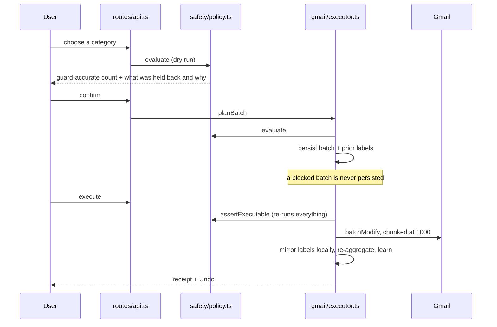

*Article 3 of a 5-part series on MailWarden's architecture. Article 1 was the founder story. Article 2 was the reference-architecture piece, written in an AI-architect voice. This one goes back to the founder register — it's the story of one file, and the bug that taught me why it has to be exactly one file.*

# The One File That's Allowed to Touch Your Inbox

Here is the sentence I kept coming back to while building the safety layer: **there is exactly one path from a click to a mailbox change.**

Not "mostly one path." Not "one path in the common case, with a couple of shortcuts for efficiency." One. Every button in MailWarden that ends in an archive or a trash — the Clean tab, a named recipe like "Marketing you never open," a category page for Promotions — funnels through the same twenty-line function before a single Gmail API call happens: `assertExecutable` in `server/src/safety/policy.ts`.

I want to walk through that file properly, because a list of fifteen guards is reference material, not a story. The interesting part isn't any one rule. It's what the file's own header comment insists on, and the bug that happened the one time I let myself half-believe it wasn't necessary.

## The agent proposes. This file decides.

Before getting to the chokepoint itself, it's worth being precise about what "agentic" means here, because it's a word that's started to mean almost anything. In MailWarden it means something specific: an LLM has judgment, never authority.

Every sender gets a fingerprint before anything reasons about it — message count, unread rate, whether an unsubscribe header is present, how repetitive the subject lines are. No body text, no subject line, no recipient ever leaves the database. A fast, deterministic rules tier (`classifyHeuristically`) resolves the large majority of senders from that fingerprint alone, for free — reply history, security-domain keywords, finance and travel hints, a template-repetition ratio that tells a real receipt (mostly distinct subjects) apart from a marketing blast (one subject reused hundreds of times). Only the genuinely ambiguous remainder — usually a few dozen senders out of a few hundred — gets escalated to an LLM, batched fifty at a time. On a 40,000-message inbox that's roughly six model calls deciding the hard cases, not forty thousand judgment calls.

The model's own instructions encode the cost of being wrong, not just the categories:

```
Safety rule, which outranks everything above: when a sender could plausibly
carry something the user cannot afford to lose — a receipt, a boarding pass, a
login code, a bank statement — choose the protective category, even at the cost
of a lower-value classification. A wrongly-kept newsletter is a minor
annoyance. A wrongly-archived password reset is a support ticket and a refund.
```

But — and this is the part worth being direct about — none of that reasoning is ever trusted with the last step. A verdict, whether it came from the free rules tier or the paid model tier, is a recommendation with a confidence score attached. It has no path to Gmail's API. That path runs through exactly one file, and that file re-derives its own answer from scratch rather than accepting the agent's.

## The chokepoint

The comment at the top of `policy.ts` is the whole design in four sentences:

```ts
/**
 * THE GUARDRAIL LAYER.
 *
 * Every mutation of a user's mailbox passes through this module. Nothing in
 * gmail/executor.ts touches Gmail without an `assertExecutable` verdict, and
 * `assertExecutable` re-runs from scratch at execute time rather than trusting
 * the plan — because a sender's classification can change between the two, and
 * a stale authorisation is not an authorisation.
 */
```

`gmail/executor.ts` is, by design, the only module in the codebase that calls Gmail's `batchModify`. And `executor.ts` is, by its own rule, incapable of calling it without first asking `policy.ts` and getting a clean verdict back. There's a source-scanning test in the smoke suite whose entire job is making sure no second caller of `batchModify` ever sneaks into the codebase — the invariant isn't just documented, it's mechanically enforced on every build.

That's the chokepoint. Now, what actually happens inside it.

## Three outcomes, not two

The obvious design for a safety layer is a boolean: allowed or not. I built that first, and it was wrong within a day, for a reason that's obvious in hindsight — a boolean forces you to choose between two bad defaults. Block too eagerly and the product nags about things that are actually fine ("40% of your mailbox" is scary-sounding and also frequently exactly what someone means to do). Block too rarely and you've built a tool that occasionally eats someone's boarding pass.

`policy.ts` returns a `GuardVerdict` with three separate outcomes instead:

```ts
export interface GuardVerdict {
  allowed: CandidateMessage[];
  exclusions: Exclusion[];
  violations: Violation[];
  requiresConfirmation: boolean;
  ok: boolean;
}
```

**Block** — the batch cannot proceed, full stop, no partial execution. `BATCH_TOO_LARGE` (over 25,000 messages), `TOO_MANY_SENDERS` (over 500), `DAILY_LIMIT` (over 50,000 messages actioned in a rolling 24 hours), `UNKNOWN_SENDER` (a stale client referencing a sender that no longer exists) — these fail closed.

**Confirm** — the batch can proceed, but only after a second, explicit yes. There's exactly one guard at this severity: `SCALE_ANOMALY`, which fires when a batch would touch 40% or more of the mailbox. It's not treated as dangerous — it's reversible for 30 days either way — it's treated as *probably intentional but worth a second look*, which is a genuinely different thing from "block."

**Exclude** — and this is the one that does almost all the real work. An exclusion silently narrows a batch — drops specific senders or specific messages and says why — while the rest proceeds. This is the line in the file's own comment that matters most: *"protection should narrow a batch, not cancel it."* If you ask to clean 400 senders and one of them is protected, you get 399 cleaned and one held back with a stated reason, not a red error screen for the whole request.

Twelve of the fifteen guards are exclusion guards. Starred mail, replied threads, protected categories, low-confidence senders, mail newer than seven days, attachments (on trash specifically — archived mail is recoverable forever, so it's held to a lower bar than trash, which starts Gmail's own 30-day countdown to real deletion) — every one of these narrows instead of refusing.

## The rule that can't be turned off

Most of the exclusion guards are overridable. If MailWarden protects a sender as `finance` and you're certain it's not — an old bank you no longer use, say — you can pin-release it and act on it going forward.

One guard doesn't have that door:

```ts
if (s.user_replied === 1) {
  blocked.add(key);
  exclusions.push({
    code: "REPLIED_SENDER",
    ...
    reason: "You have replied to this sender — Mailwarden never bulk-actions those.",
  });
  continue;
}
```

The comment above the function explains why the ordering matters: *"An explicit user release (-1) overrides automatic protection, but never overrides a reply — the user writing back is not something we second-guess."* You can tell the system "I know better than your finance guard." You cannot tell it "I know better than the fact that I personally wrote back to this person." That's a deliberate asymmetry, not an oversight — a reply is the strongest signal the app has that a human relationship exists on the other end of an address, and no confidence score or category label gets to outrank it.

## A stale plan is not an authorization

The comment I quoted at the top says `assertExecutable` "re-runs from scratch at execute time rather than trusting the plan." I want to be specific about why that's load-bearing and not just defensive coding.

The consent flow has three steps, each hitting the policy module independently:



Between the first dry run and the final execute, real time passes — sometimes seconds, sometimes (if a plan sits unconfirmed) much longer. A sender's classification can change in that window. A new message can arrive and get starred. The user could, in another tab, reply to someone in the batch. If `executor.ts` trusted the plan it had already validated, none of that would matter — it would execute against a snapshot of the world that's no longer true.

So it doesn't trust the plan. `assertExecutable` calls `evaluate` again, from the database's current state, and throws if anything now blocks:

```ts
export function assertExecutable(input: GuardInput): GuardVerdict {
  const verdict = evaluate({ ...input, confirmed: true });
  const blocking = verdict.violations.filter((v) => v.severity === "block");
  if (blocking.length > 0) {
    throw new GuardError(blocking.map((v) => v.message).join(" "), blocking);
  }
  return verdict;
}
```

This is the same class of bug as a time-of-check-to-time-of-use race in systems security, just at the scale of minutes instead of microseconds — and the fix is the same in both domains: don't cache the authorization, re-derive it at the moment it's spent.

## The hole I didn't see until the first real cleanup

Here's the honest part. Every guard I've described so far — protected senders, confidence floor, recency, velocity, scale anomaly — operates at the *sender* level. And for a long time, that felt complete. A sender is either safe to act on or it isn't; act on the safe ones.

Except that's not true, and I found out why on my own inbox, running my first real full cleanup instead of a synthetic demo. Sender-level judgment has a hole baked into its own logic: once a sender clears the bar, *every message that sender ever sent* clears it with them. That's fine for message 400 of an identical newsletter. It is badly wrong for the one message in that pile of 400 that I'd starred, and for the one that happened to carry an attachment, sitting in an otherwise-disposable stream of marketing mail.

The header comment on the fix, `guardMessageLevel`, says it more bluntly than I would have before it bit me:

```ts
/**
 * G9–G12 — PER-MESSAGE protection.
 *
 * Every other guard here works at sender level, which leaves a real hole: once
 * a sender is judged actionable, every message they ever sent is actionable
 * with it. That is fine for the 400th identical newsletter and badly wrong for
 * the one message in that pile you starred, the one carrying an invoice PDF,
 * and the one sitting in a thread you replied to.
 */
```

So there's a second, independent guard pass that runs *after* the sender-level pass, over individual messages: starred (absolute, both archive and trash), part of a thread you replied to (absolute — this is where `REPLIED_SENDER`'s sibling rule lives, catching a reply even inside an otherwise-actionable sender), has an attachment (blocks trash specifically, archive still allowed), and Gmail's own `IMPORTANT` label (same asymmetry — blocks trash, not archive).

The guard hierarchy ended up three layers deep, not one:

```
sender level    → is this sender actionable at all (protected category, confidence, reply history)
message level   → within an actionable sender, is this specific message exempt (starred, replied thread, attachment, important)
batch level     → across everything that survives both, are the volume and scale sane (velocity ceilings, scale-anomaly confirm)
```

I don't think I'd have designed it three layers deep from a whiteboard. I designed it one layer deep, shipped it, ran it against 6,010 real messages, and the gap showed up exactly where the comment now says it would — not as a crash, but as a boarding pass sitting in a batch of "safe to archive" mail from an airline that had also, elsewhere, sent me two hundred fare-sale emails I genuinely didn't want. Same sender. One message was a keepsake. The classifier had no way to know that from the sender alone, because the truth wasn't a property of the sender — it was a property of that one message.

## What this actually buys, in numbers

`safety/limits.ts` keeps every threshold in one file, and the comment there states the tradeoff the whole design leans on: *"the cost of a limit being too tight is that a user runs two batches instead of one. The cost of a limit being too loose is an irreversible-feeling mistake across someone's entire mail history."*

Fifteen guards, three outcomes, one un-releasable rule, one re-derivation at execute time, one second layer that only exists because the first layer's own logic guaranteed it would eventually miss something. None of this is a roadmap item — `policy.ts` is 436 lines, already shipped, and it's the file every archive and trash button in the product runs through, without exception, whether the click came from a hand-picked sender list, a named recipe, or a category page. The chokepoint isn't a design principle I hold to. It's a single file I can point to.

## What people keep asking

A few questions came up after I first wrote about this, and they're worth answering directly rather than leaving implicit in the code above.

**How are starred mail and receipts actually protected?** Two independent layers. Starred messages and anything in a thread you've replied to are dropped from every batch at the message level (G9/G10), with no override — not even the sender pin-release can undo a reply. Receipts live in `transactional`, one of five categories (with security, finance, travel, personal) that can never be bulk-actioned without an explicit per-sender release.

**Is there a function that tells a real receipt apart from a promotional attachment?** Not one that reads the attachment — MailWarden never opens message content, by design. It's inferred behaviorally: no unsubscribe header, plus mostly-distinct subject lines across that sender's messages (real receipts vary; ad blasts repeat one template). It's a proxy, which is exactly why `transactional` is also a protected category regardless of how confident that proxy is.

**Are subscriptions taken into account?** Yes, two ways. `hasUnsubscribe` is itself a classification signal — bulk mail almost always carries it, security and transactional mail almost never does. And there's a real unsubscribe engine that tries an RFC 8058 one-click POST first, falls back to handing you the link when one-click isn't safely automatable, and hands off `mailto:`-only unsubscribes to your own mail client rather than requesting send access to do it for you.

**Can you tune it to just delete a category, like promotional?** You can target a category or a named recipe like "Marketing you never open" directly — that's the selection layer. What you can't do is make that selection skip the guardrail: every category-level batch still runs through the same fifteen-guard evaluation as a hand-picked one, and the five protected categories can't be targeted for bulk deletion at all, regardless of how the request was framed.
