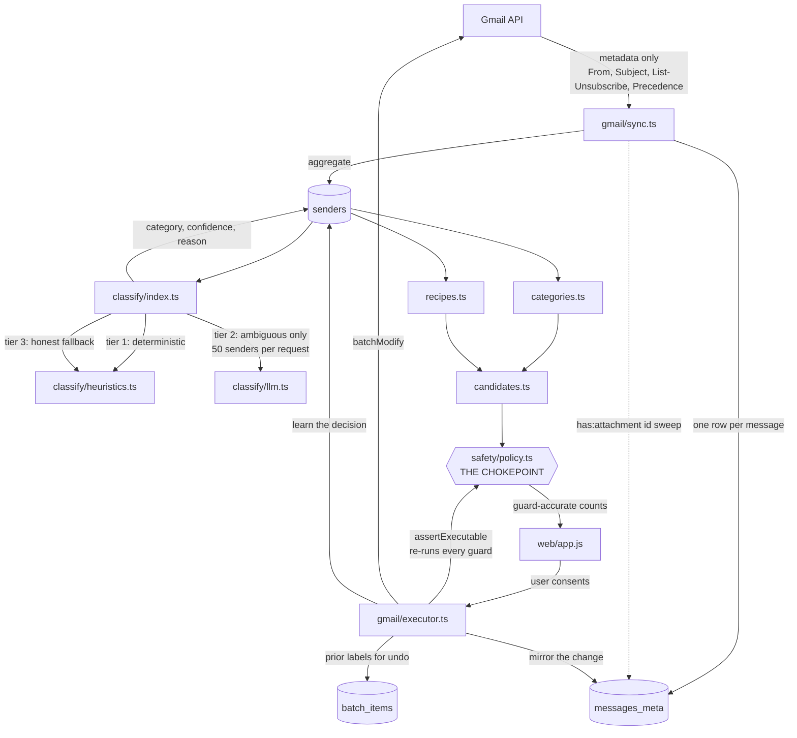
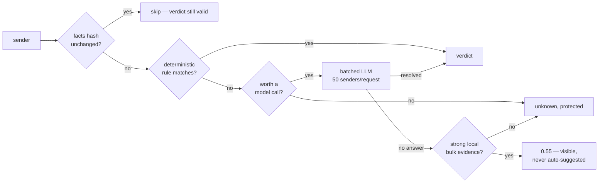
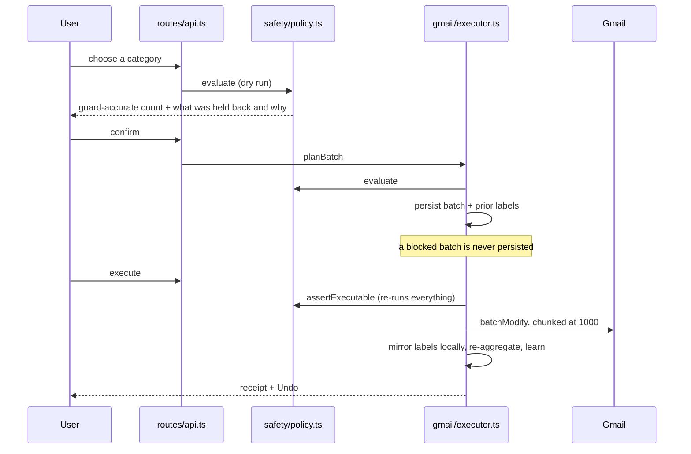

# Agent Architecture

How Mailwarden actually works, module by module. Everything here reflects code
in `server/src`, not intent — where the two ever diverge, the code is right and
this document is a bug.

---

## 1. The one-paragraph version

Mailwarden reads **metadata only** from Gmail, collapses tens of thousands of
messages into a few hundred **senders**, classifies those senders with
deterministic rules first and a language model only for the ambiguous
remainder, then routes every proposed mailbox change through a **single
guardrail chokepoint** that can narrow or refuse it. Nothing mutates Gmail
except one function, and that function re-runs the entire policy from scratch
before it acts.

---

## 2. The three ideas the whole design rests on

**Sender-level, not message-level.** On a real 6,010-message mailbox, 261
distinct senders account for everything. That is a 23× reduction in decisions
for the user and roughly a 100× reduction in inference cost. It is why the free
tier can finish a real job inside OpenRouter's 50-request/day ceiling, and why
the UI can ask ~200 questions instead of 40,000.

**Metadata only, by construction.** Sync requests `format: "metadata"` with an
explicit header allowlist, and the database stores a *salted hash* of each
subject rather than the subject. There is no column that could hold a message
body. Content is fetched only when the user opens a specific message, and never
written anywhere.

**Never permanently delete.** The OAuth scope is `gmail.modify`, which cannot
permanently delete — Google will not grant that capability with this scope. The
product promise and the CASA Tier 2 cost argument are the same fact.

---

## 3. Data flow

---

## 4. Modules

| Module | Lines | Responsibility |
|---|---:|---|
| `gmail/sync.ts` | 563 | Full + incremental sync, sender aggregation, attachment sweep |
| `gmail/executor.ts` | 387 | Plan, execute, undo. **The only writer to Gmail** |
| `gmail/reader.ts` | 225 | On-demand message reading. Writes nothing |
| `gmail/unsubscribe.ts` | 225 | RFC 8058 one-click, link, mailto — with SSRF containment |
| `gmail/client.ts` | 80 | OAuth client, token decrypt, `ReconnectRequired` |
| `safety/policy.ts` | 436 | **The chokepoint.** 15 guards, `evaluate` + `assertExecutable` |
| `safety/limits.ts` | 51 | Every threshold, in one place |
| `classify/index.ts` | 282 | Tiered orchestration, verdict caching, decision learning |
| `classify/heuristics.ts` | 263 | Deterministic rules + honest fallback tier |
| `classify/llm.ts` | 417 | Batched sender classification, both providers |
| `classify/taxonomy.ts` | 43 | The 10 categories; which are protected |
| `candidates.ts` | 59 | Action-aware message selection, shared by all callers |
| `categories.ts` | 327 | Browse-by-kind view with guard-accurate counts |
| `recipes.ts` | 214 | Named one-click cohorts |
| `lib/entitlements.ts` | 126 | Server-enforced plan limits |
| `routes/api.ts` | 585 | HTTP surface |
| `smoke.ts` | 927 | 139 offline checks, including source-level invariants |

---

## 5. Sync

Two strategies, chosen automatically.

**Full sync** pages `messages.list`, then fetches each id with
`format: "metadata"` at concurrency 12. It reads the `historyId` cursor
**before** listing, not after — a full scan takes minutes, and mail arriving
during it would be invisible to every future incremental pass otherwise.

**Incremental sync** calls `users.history.list` from the stored cursor and
applies only what changed. Gmail keeps roughly a week of history; when the
cursor has aged out it returns 404, which is treated as a normal outcome and
falls back to a full scan.

Measured on the same 6,010-message account:

| | Full | Incremental |
|---|---:|---:|
| Sync | 218.6 s | **0.7 s** |
| Classify | 80.4 s | **0.1 s** |
| LLM requests | 1 | **0** |

**Aggregation** collapses `messages_meta` into one `senders` row each. Two
non-obvious rules live here:

- Reply detection is a **ratio** (≥25%), not a boolean. "Has the user ever
  replied?" is the intuitive test and it is wrong — one stray reply to a
  marketing blast once locked 15 senders covering 1,964 messages, a third of a
  real mailbox.
- Counts **exclude trashed mail** and are **zeroed before upsert**. Without the
  reset, a sender whose mail was entirely trashed produces no aggregation row
  and keeps its old total forever.

---

## 6. Classification — four tiers

**Tier 0 — verdict cache.** A bucketed fingerprint of the signals a verdict
depends on. Bucketed deliberately: a raw message count changes on nearly every
sync, so hashing it would re-classify — and re-bill — the entire mailbox every
pass. Volume buckets by `log2`, rates round to one decimal; the signals that
actually flip a category (unsubscribe header, reply status, user decision,
Gmail labels) stay exact.

**Tier 1 — deterministic heuristics.** Resolves ~51% of senders for free, fully
offline. Protective rules run **first and win**: a false "security" costs the
user nothing, a false "promotional" costs them a password reset.

**Tier 2 — LLM.** Only the ambiguous remainder, batched 50 senders per request,
4-way concurrent, sorted by message count so a truncated free-tier budget always
spends itself on the biggest wins. The payload is a **content-free projection** —
counts, rates, ratios, domains. No subjects, no bodies, no recipients.

**Tier 3 — honest fallback.** When the model is unavailable, senders used to be
marked `unknown` and locked permanently; an outage silently cost ~6% of the
mailbox. Now, where bulk evidence is strong and entirely local, a stated
low-confidence guess (0.55) is made: above the guard layer's hard floor so it is
visible and actionable, below the auto-suggest bar so nothing sweeps it up. It
is not cached, so the next scan retries properly.

**The agent learns.** Executing a batch records `user_decision`; undoing one
reverses it. A decided sender skips the model entirely next pass. Ranked
deliberately *below* the protective rules — a past "archive" must never unlock a
sender that has since started carrying boarding passes.

---

## 7. The guardrail chokepoint

Every mutation passes through `safety/policy.ts`. Two severities: `block` fails
closed; `confirm` needs explicit second approval. **Exclusions** are different —
they narrow a batch and report why, rather than cancelling it. Protection should
shrink a job, not kill it.

### Sender-level guards

| Guard | Effect |
|---|---|
| `NEVER_DELETE` | Refuses any action that is not archive or trash |
| `REPLIED_SENDER` | You correspond with them |
| `USER_PINNED` | You pinned them |
| `PROTECTED_CATEGORY` | security, transactional, finance, travel, personal |
| `LOW_CONFIDENCE` | Below the hard floor (0.4) |
| `UNKNOWN_SENDER` | Not in the account — fails closed |

### Message-level guards

Added after the first real cleanup, because every guard above is sender-level:
once a sender was actionable, *every* message they sent was too.

| Guard | Protects | Applies to |
|---|---|---|
| `STARRED` | Anything you starred | all actions |
| `IN_REPLIED_THREAD` | Any message in a thread you wrote in | all actions |
| `TOO_RECENT` | Last 7 days | all actions |
| `HAS_ATTACHMENT` | Messages carrying files | **trash only** |
| `GMAIL_IMPORTANT` | Gmail's importance flag | **trash only** |

The trash-only split is deliberate: archiving is reversible forever, while trash
starts a 30-day clock that ends in real deletion.

### Batch-level guards

`BATCH_TOO_LARGE` · `TOO_MANY_SENDERS` · `DAILY_LIMIT` · `SCALE_ANOMALY`
(≥40% of the mailbox requires a second confirmation).

### The TOCTOU rule

**A clean plan is not an authorisation to execute.** `assertExecutable`
re-derives every block guard from scratch at execution time, because a sender
can be reclassified, pinned, or replied to in between. If re-validation narrows
the batch, the removed messages are deleted from `batch_items` so undo stays
exact.

---

## 8. The consent loop

Counts shown to the user are produced by **dry-running the real policy**, so the
number on the tile is exactly what will happen. A tile promising 2,341 that
delivers 1,800 destroys trust faster than one that never existed.

---

## 9. Storage

SQLite via `better-sqlite3`, one file on a Fly volume.

| Table | Holds |
|---|---|
| `users` | plan, free-batch counter |
| `accounts` | encrypted refresh token, `history_id` cursor, sync state |
| `messages_meta` | sender, date, size, labels, **subject hash**, attachment flag |
| `senders` | the unit of decision — counts, category, confidence, reason, learned decisions |
| `batches` / `batch_items` | **this is the undo feature** — prior labels per message |
| `audit_log` | every action, user-visible and exportable |
| `llm_usage` | daily request budget accounting |

No bodies. No plaintext subjects. No recipients.

**Single instance on purpose** — SQLite cannot be shared across machines.
Postgres is the gate on horizontal scale, and on public launch.

---

## 10. What enforces this

`smoke.ts` runs 139 offline checks with no network and no keys, including
**source-level invariants** that fail the build if:

- `messages.delete`, `batchDelete`, `mail.google.com`, or `gmail.readonly` appear
- `batchModify` is called from anywhere but `executor.ts`
- `executor.ts` stops routing through `assertExecutable`
- `reader.ts` gains an INSERT/UPDATE/DELETE, logs, or skips its ownership check
- the classifier imports the reader
- the schema gains a plaintext `subject` column
- an inline `<script>` appears in `web/` (the CSP blocks them — this shipped once)

`scripts/e2e.mjs` adds 23 checks against a running server, including a real
browser over CDP asserting the client actually executes. Three production
failures so far were invisible to unit tests *and* to status codes.

---

## 11. Known gaps

| Gap | Consequence |
|---|---|
| Undo never run against live Gmail | The backstop for everything is unproven |
| SQLite, single instance | Blocks horizontal scale and public launch |
| `auto_stop_machines = "stop"` | May kill a long scan mid-flight |
| No scheduled re-scan (41) | The subscription has no recurring job yet |
| Unsubscribe verification (45) | `unsubscribed_at` is recorded; nothing checks it yet |
| Stripe (24–27) | No upgrade path; free tier is temporarily unlimited |
| Token key is env-based, not KMS | It decrypts every stored refresh token |
